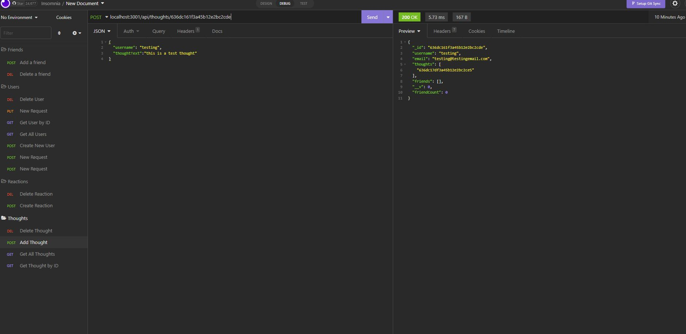

# Social Network Terry Kim
Social Network Application by Terry Kim

This application will be using Insomnia to create a social network database where we can add users, delete users, add thoughts, delete thoughts, and add reactions

This uses a basic routing system where each GET, POST, and DELETE will update the users and their thoughts. 

-When a user is created, they have a specific ID which can be searched specifically using that ID.

-When a user creates a thought, that thought will also have a specific ID which can be searched.

-All IDs via thoughts and users can be deleted and searched using /api/thoughts(or user)/(ID#)

## Screenshots

Link to the video:
https://drive.google.com/file/d/1ULKhnOId_75umKlliIBCIBCZpjFFnC5D/view
## Authors

- [@Terry Kim](https://www.github.com/TeryKing)

## Acknowledgements

Georgia Tech Coding Bootcamp: https://bootcamp.pe.gatech.edu/coding/

W3Schools: https://www.w3schools.com/

MDN : https://developer.mozilla.org/en-US/

Readme.so: https://readme.so/

NPMJS: https://www.npmjs.com/
## Feedback

If you have any feedback, please reach out to me at Tery_x3@hotmail.com

